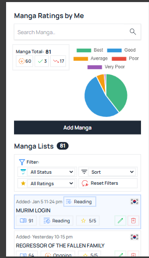

# Manga, Manhua, Manhwa Management Web Application

It's purpose is to basically add a manga so that i can add a status, type, chapter and the ratings of every manga.

# TECH USED:

Backend: FIREBASE
Front-end: VUE.JS, TAILWINDCSS

# FEATURES:

Sort
Search
CRUD Operations
Data visualizations

# PROJECT IMAGES

